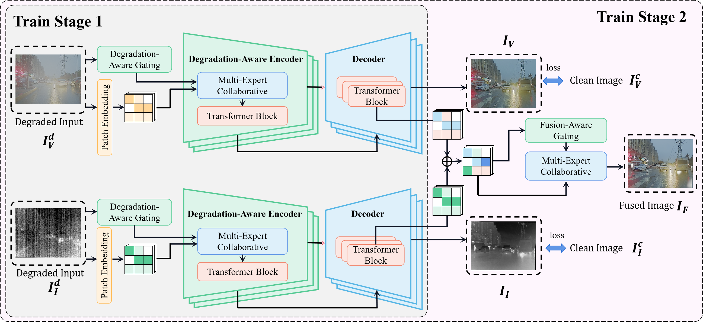
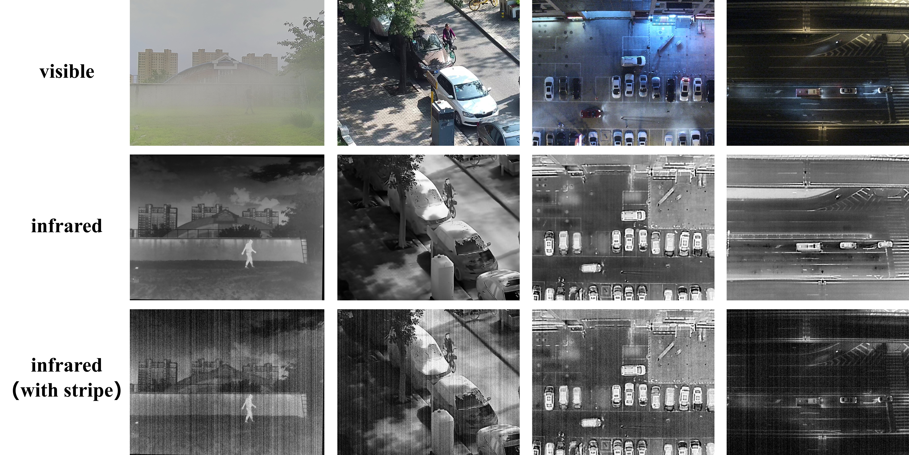

# [ICML2025] Task-Gated Multi-Expert Collaboration Network for Degraded Multi-Modal Image Fusion 

Yiming Sun, Xin Li, Pengfei Zhu, Qinghua Hu, Dongwei Ren, Huiying Xu, Xinzhong Zhu 

- [*[Paper]*]()
- [*[GitHub]*](https://github.com/LeeX54946/TG-ECNet)
---

<div align=center></div>

---

<h2> <p align="center"> DeMMI-RF Dataset </p> </h2>  

---
### Preview

The preview of our dataset is as follows.

---

Five different degradations were set for visible light images, and suitable scenes were selected for each degradation, as shown in the following figure.
<div align=center></div>

---

Stripe noise was applied to the infrared image in different scenes as shown in the figure.

<div align=center></div>

---

### Details

- **Source**: All images are selected from the following datasets:
   - [MSRS](https://github.com/Linfeng-Tang/MSRS)
   - [M3FD](https://github.com/JinyuanLiu-CV/TarDAL)
   - [FMB](https://github.com/JinyuanLiu-CV/SegMiF)
   - [LLVIP](https://github.com/bupt-ai-cz/LLVIP)
   - [RoadScene](https://github.com/hanna-xu/RoadScene)
   - [EMS](https://github.com/XunpengYi/EMS)
   - [DroneVehicle](https://github.com/VisDrone/DroneVehicle)
   - [DroneRGBT](https://github.com/VisDrone/DroneRGBT)
   - [Bosch(only for image restoration)](https://zenodo.org/records/12706046)


#### Total distribution of training images:
- **35418** (for image restoration)
  
|           Degradation            | Bosch | M3FD | FMB | LLVIP |           MSRS           | RoadScene  |  DroneVehicle   | DroneRGBT  | All  |
|:--------------------------------:|:-----:|:----:|:---:|:-----:|:------------------------:|:----------:|:---------------:|:----------:|:----:|
| **Gaussian Noise**<br>(Sigma=15) | 1762  | 130  | 133 |  226  |            19            |     —      |      2700       |    300     | 5270 |
| **Gaussian Noise**<br>(Sigma=25) | 1756  | 129  | 132 |  225  |            19            |     —      |      2700       |    300     | 5261 |
| **Gaussian Noise**<br>(Sigma=50) | 1759  | 129  | 132 |  226  |            19            |     —      |      2700       |    300     | 5265 |
|             **Haze**             | 1968  | 173  | 358 |   —   |            —             |     —      |      2700       |    307     | 5506 |
|         **DefocusBlur**          | 1528  |  —   |  —  | 1622  |           388            |    155     |      2700       |    300     | 6693 |
|         **Stripe Noise**         |   —   | 3900 |  —  |   —   | 509<br>(same as **EMS**) |     —      |      2700       |    300     | 7409 |

---
- **26631** (for image fusion)

|             Degradation             | M3FD | FMB | LLVIP |           MSRS           | RoadScene  |  DroneVehicle   | DroneRGBT  |  All  |
|:-----------------------------------:|:----:|:---:|:-----:|:------------------------:|:----------:|:---------------:|:----------:|:-----:|
|  **Gaussian Noise**<br>(Sigma=15)   | 130  | 133 |  226  |            19            |     —      |      2700       |    300     | 3508  |
|  **Gaussian Noise**<br>(Sigma=25)   | 129  | 132 |  225  |            19            |     —      |      2700       |    300     | 3505  |
|  **Gaussian Noise**<br>(Sigma=50)   | 129  | 132 |  226  |            19            |     —      |      2700       |    300     | 3506  |
|              **Haze**               | 173  | 358 |   —   |            —             |     —      |      2700       |    307     | 3538  |
|           **DefocusBlur**           |  —   |  —  | 1622  |           388            |    155     |      2700       |    300     | 5165  |
|          **Stripe Noise**           | 3900 |  —  |   —   | 509<br>(same as **EMS**) |     —      |      2700       |    300     | 7409  |

---
#### Total distribution of test images:

- **9895** (for image restoration or fusion)

|             Degradation             | M3FD | FMB | LLVIP | MSRS | RoadScene | DroneVehicle | DroneRGBT | All  |
|:-----------------------------------:|:----:|:---:|:-----:|:----:|:---------:|:------------:|:---------:|:----:|
|  **Gaussian Noise**<br>(Sigma=15)   |  56  | 57  |  97   |  8   |     —     |     1000     |    300    | 1518 |
|  **Gaussian Noise**<br>(Sigma=25)   |  56  | 57  |  97   |  8   |     —     |     1000     |    300    | 1518 |
|  **Gaussian Noise**<br>(Sigma=50)   |  56  | 57  |  97   |  8   |     —     |     1000     |    300    | 1518 |
|              **Haze**               |  75  | 153 |  150  |  —   |     —     |     1000     |    300    | 1678 |
|           **DefocusBlur**           |  —   |  —  |  696  | 167  |    66     |     1000     |    300    | 2229 |
|          **Stripe Noise**           |  84  |  —  |  50   |  —   |     —     |     1000     |    300    | 1434 |

---
- **510** (for Multi-Task image restoration or fusion)

|                 Degradation Type                 | Num |                                  Degradation Type                                  | LLVIP |
|:------------------------------------------------:|:---:|:----------------------------------------------------------------------------------:|:-----:|
|    **Haze** and **Gaussian Noise**(Sigma=15)     | 30  |                            **Haze** and **DefocusBlur**                            |  30   |
|    **Haze** and **Gaussian Noise**(Sigma=25)     | 30  |                           **Haze** and **Stripe Noise**                            |  30   |
|    **Haze** and **Gaussian Noise**(Sigma=50)     | 30  |                        **DefocusBlur** and **Stripe Noise**                        |  30   |
| **DefocusBlur** and **Gaussian Noise**(Sigma=15) | 30  |                   **Haze**, **Stripe Noise** and **DefocusBlur**                   |  30   |
| **DefocusBlur** and **Gaussian Noise**(Sigma=25) | 30  |            **Haze**, **Stripe Noise** and **Gaussian Noise**(Sigma=50)             |  30   |
| **DefocusBlur** and **Gaussian Noise**(Sigma=50) | 30  |             **Haze**, **DefocusBlur** and **Gaussian Noise**(Sigma=50)             |  30   |
|   **Stripe** and **Gaussian Noise**(Sigma=15)    | 30  |         **DefocusBlur**, **Stripe Noise** and **Gaussian Noise**(Sigma=50)         |  30   |
|   **Stripe** and **Gaussian Noise**(Sigma=25)    | 30  |    **Haze**, **DefocusBlur**, **Stripe Noise** and **Gaussian Noise**(Sigma=50)    |  30   |
|   **Stripe** and **Gaussian Noise**(Sigma=50)    | 30  |                                                                                    |       |

---

### Download

- [Google Drive]()(Only for Test)
- [Baidu Yun](https://pan.baidu.com/s/1KbaGUXzuOW6ej4maHN5ZcQ?pwd=TGEC)


If you have any question or suggestion about the dataset, please email to `leexin_seu@seu.edu.cn`.

---

<h2> <p align="center"> TG-ECNet </p> </h2>  

---

## Set Up on Your Own Machine

---

When you want to dive deeper or apply it on a larger scale, you can configure our TarDAL on your computer following the steps below.

We strongly recommend that you use Conda as a package manager.

```shell
# create virtual environment
conda create -n tgecnet 
conda activate tgecnet
# select pytorch version yourself
# install tgecnet requirements
pip install -r requirements.txt
```
---

## Quick Start

---

If you want to test the performance of fusion using this method, ensure `stage2/ckpt/stage2_pretrained.ckpt`.
Place your data in `stage2/test.py` to test your own data. You need to place the data as follows:
```
data
└── test
    ├── denoise
    |   ├── your dataname1
    |   |   ├── input # images with degradations
    |   |   ├── visible # clean visible images to provide color information
    |   |   └── infrared # infrared images
    |   └── your dataname2
    |       └──...
    ├── dehaze
    |   ├── your dataname3
    |   |   ├── input # images with degradations
    |   |   ├── visible # clean visible images to provide color information
    |   |   └── infrared # infrared images
    |   └── your dataname4
    |       └──...
    ├── deblur
    |   └── ...
    └── stripe
        └── ...
```
Then, modify `stage2/test.py` to test your own data.

```shell
conda activate tgecnet
python stage2/test.py
```
And the result will be in `stage2/output/`.

## Train

### Data Preparation

You should put the data in the correct place in the following form.

```
data
└── Train
    ├── degrad
    |   ├── noise15
    |   |   ├── Bosch
    |   |   ├── M3FD
    |   |   └── ...
    |   ├── noise25
    |   ├── noise50
    |   ├── haze
    |   ├── DefocusBlur
    |   └── stripe
    |       └──...
    ├── visible
    |   └── ...
    └── infrared
        └── ...

```
### Stage Ⅰ

Before training the model, you need to modify the `stage1/options.py` and the `txt` file in `stage1/data_dir`.
```shell
conda activate tgecnet
python stage1/train.py
```
And then you should run `stage1/test.py` with the obtained `stage1/ckpt/stage1_pretrained.ckpt` to obtain  the `stage1.pth` which can be used in Stage Ⅱ.
We also offer a pretrained edition as `stage2/stage1.pth`.

---

### Stage Ⅱ

Before training the model, you need to modify the `stage2/options.py` and the `txt` file in `stage2/data_dir`.
```shell
conda activate tgecnet
python stage2/train.py
```
And then you should run `stage2/test.py` with the obtained `stage2/ckpt/stage2_pretrained.ckpt` to obtain the outputs.

---

We offer the pretrained model parameters, you can place them like this:

```
TG-ECNet
└── stage1
|   ├── ckpt
|   |   └── stage1_pretrained.ckpt
└── stage2
    ├── ckpt
    |   └── stage2_pretrained.ckpt
    └── stage1.pth
```

- [Google Drive](https://drive.google.com/drive/folders/1DmTgjjz17mhRdSJtWR7pluGOKgrhukVv?usp=sharing)
- [Baidu Yun](https://pan.baidu.com/s/1JPCKU-9ohOIsmj2A5q4F2g?pwd=TGEC)

---

### Any Question

If you have any other questions about the code, please email `leexin_seu@seu.edu.cn`.


## Citation

If this work has been helpful to you, please feel free to cite our paper!
Yiming Sun, Xin Li, Pengfei Zhu, Qinghua Hu, Dongwei Ren, Huiying Xu, Xinzhong Zhu 

```
@inproceedings{,
  title={Task-Gated Multi-Expert Collaboration Network for Degraded Multi-Modal Image Fusion},
  author={Sun, Yiming and Li, Xin and Zhu, Pengfei and Hu, Qinghua and Ren, Dongwei and Xu, Huiying and Zhu, Xinzhong},
  booktitle={},
  pages={},
  year={2025}
}
```
